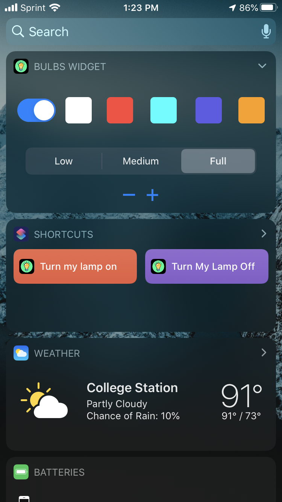

# triones-bulbs-controller

Custom application to control Triones based smart bulbs. The existing application is buggy and does not have Siri support. I first reverse engineered the protocol with the help of [this Github repo](https://github.com/madhead/saberlight/blob/master/protocols/Triones/protocol.md). Then I developed a node.js server that connects to the bulbs using [noble](https://github.com/noble/noble) and has the ability to send commands to the bulbs. This server waits for POST requests with the command to send and GET request to get the current command.

Using this server, I implemented an iOS widget with the ability to turn power ON/OFF and change light bulb color and brightness. Also, I implemented Siri shortcuts for turning the lamp off or turning it on with full brightness.

## Widget

Above is a screenshot of the widget. The bulb can be turned ON/OFF using the switch and the colors can be changed using the colored buttons. Brightness can be set in two ways:
1. Choose Low, Medium or Full brightness which are presets.
2. Use the +/- buttons to increase or decrease brightness in small increments.

## Shortcuts

 

There are two shortcuts implemented in the iOS app. One to turn the bulbs off, and the other to turn the bulbs on with full brightness. These shortcuts can be used with NFC tags to tap the phone on the tag to turn the lamp ON/OFF. Also, siri can be used to turn the bulb ON/OFF with custom commands through the Shortcuts app as shown in the above screenshots.
